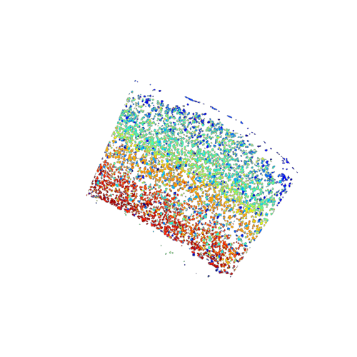

Quick start / tldr page
=======================

This tl;dr guide is for you if you already know what happens in a SSAM
analysis or if you don’t care.

For everyone else we recommend using the full
`userguide <../userguide.md>`__.

Installation
------------

Setup a ``conda`` environment:

::

   conda create -n ssam python=3.11 numpy=2.0.2 gxx_linux-64
   conda activate ssam

Install ``SSAM`` via ``pip``:

::

   pip install ssam

Example Data
------------

All following steps in ``python``:

::

   import pandas as pd
   import matplotlib.pyplot as plt
   import ssam

   # Load example data
   df = pd.read_csv(
           "https://s3.amazonaws.com/starfish.data.spacetx/spacetx-website/data/smFISH_Allen/s3_spot_table.csv",
           usecols=["rotated_x", "rotated_y", "gene"]
        )
   
   # Rename columns to match the format SSAM expects: x, y, gene
   df = df.rename(columns={'rotated_x': 'x', 'rotated_y': 'y'})

   # Normalize coordinates
   df.x -= df.x.min()
   df.y -= df.y.min()

   # Set the width and height of the tissue
   width = df.x.max()
   height = df.y.max()

Create SSAM dataset and vector field
------------------------------------

::

   # Create a new SSAM dataset
   ds = ssam.SSAMDataset("ssam_msmfish") # This will create a new directory named "ssam_msmfish" in the current working directory

   # Create a SSAM analysis object
   analysis = ssam.SSAMAnalysis(ds, verbose=True)

   # Run KDE
   analysis.run_kde(df, width=width, height=height)

   # Find local maxima
   analysis.find_localmax()
       
   # Normalize and scale vectors
   analysis.normalize_vectors()
   analysis.scale_vectors()

Creating the *de novo* cell map
-------------------------------

::

   # Cluster vectors
   analysis.cluster_vectors(resolution=0.6, metric='correlation')

   # Map cell types       
   analysis.map_celltypes()
   analysis.filter_celltypemaps(min_norm=0.05) # Adjust `min_norm` for filtering

   # Plot cell type map
   plt.figure(figsize=(5, 5))
   ds.plot_celltypes_map()

   Visualisation of cell type map.

Creating the tissue domain map
------------------------------

::

   # Create binned cell type maps
   analysis.bin_celltypemaps(step=10, radius=100)

   # Find domains
   analysis.find_domains(n_clusters=20, merge_remote=True, merge_thres=0.7, norm_thres=1500)

   # Plot domain map
   plt.figure(figsize=[5, 5])
   ds.plot_domains()

.. figure:: ../images/domains.png
   :alt: Visualisation of final domain map exhibitin clearly separated
   domains.

   Visualisation of final domain map exhibitin clearly separated
   domains.
