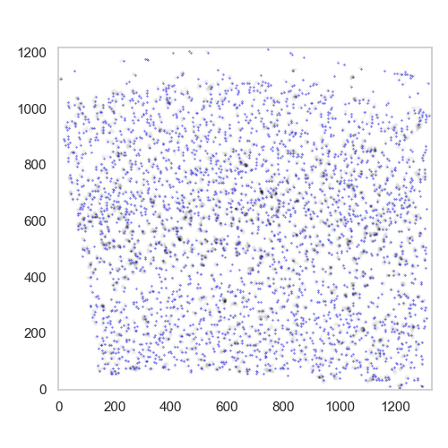

Creating the vector field
=========================

SSAM converts the discrete mRNA locations into mRNA desntiy
(that can be thought of as continuous “gene expression clouds” over
the tissue) through application of
`Kernel Density Estimation <https://en.wikipedia.org/wiki/KDE>`__.

Prepare data for KDE
--------------------

To run KDE, we need to provide the data with the ``width`` and
``height`` of the image. It is straightforward to use the maximum
coordinates of the mRNA spots for this:

::

   width = df.x.max()
   height = df.y.max()

Run KDE
-------

Now you can calculate a mRNA density estimate with the ``run_kde`` method.
You can specify the dataframe (with ``x``, ``y``, and ``gene`` columns),
width, height.

An important consideration here is the `kernel bandwidth <kernel_bandwidth.md>`__.
As default, we recommend using a Gaussian kernel with a bandwidth of 2.5:

::

   # `bandwidth` is optional (default is 2.5)
   analysis.run_kde(df, width=width, height=height, bandwidth=2.5)

Local maxima search and normalization
-------------------------------------

In order to reduce the computational burden, we use the local maxima of
the mRNA density as a proxy for the spatial gene expression from cells.

Here we apply the ``find_localmax`` function to find the local maxima of
the mRNA density:

::

   analysis.find_localmax(
       min_norm=0.2, # optional, the total gene expression threshold
       min_expression=0.027, # optional, the per gene expression threshold
   )
   
Visualization
-------------

After the local maxima have been identified, they can be visualised:

::

   plt.figure(figsize=[5, 5])
   ds.plot_l1norm(cmap="Greys")
   ds.plot_localmax(c="Blue", s=0.1)

The plot will show the local maxima as blue dots superimposed on the
norm of the vector field.

   plot found maxima superimposed with the mask

Normalization
-------------

Once the local maxima have been identified, we can normalize the mRNA
density and the local maxima vectors. This is done by either the 
``normalize_vectors`` or ``normalize_vectors_sctransform`` method.

The ``normalize_vectors`` method normalizes the mRNA density and the
local maxima vectors using log normalization of pseudocounts. This is
currently the default method in SSAM.

::

   analysis.normalize_vectors()

Alternatively, you can use the ``sctransform`` method for normalization:

::

   analysis.normalize_vectors_sctransform() # requires pyarrow, R and sctransform package

Now we are ready to continue with mapping the cell types in
`guided <guided.md>`__ or `de novo mode <de_novo.md>`__.
