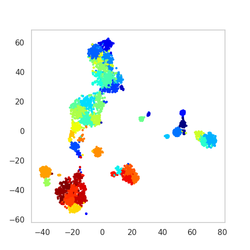

SSAM *de novo* analysis
=======================

The steps of the *de novo* analysis are briefly discussed below, with
links to more detailed discussion:

-  :doc:`Clustering <07-clustering>`__
-  :doc:`Diagnostic plots <08-diagnostic>`__
-  :doc:`Visualisation of cell-type signatures: tSNE, UMAP <10-visualisation>`__

Clustering of expression vectors
--------------------------------

SSAM supports :doc:`a number of clustering methods <07-clustering>`__.
Here we use the Leiden algorithm using 22 principle components, a
resolution of 0.6.

::

   analysis.cluster_vectors(
       min_cluster_size=0,
       pca_dims=22,
       resolution=0.6,
       metric='correlation')

Cluster annotation and diagnostics
----------------------------------

SSAM provides :doc:`diagnostic plots <08-diagnostics>`__ which can be used to
evaluate the quality of clusters, and `facilitates the annotation of
clusters <cluster_annotation.md>`__.

Visualisng the clusters
-----------------------

SSAM supports
:doc:`cluster visualisation via 2D embeddings (t-SNE and UMAP) <10-visualisation>`__.
Here we give an example of the t-SNE plot:

::

   plt.figure(figsize=[5, 5])
   ds.plot_tsne(pca_dims=22, metric="correlation", s=5, run_tsne=True)
   plt.savefig('images/tsne.png')

   plot of t-SNE embedding of cell types

Cell type map
-------------

Once the clusters have been evaluated for quality, we can generate the
*de novo* cell-type map. This involves classifying all the pixels in
the tissue image based on a correlation:

::

   analysis.map_celltypes()

Now we can filter the cell-type map to remove spurious pixels that has low
gene expression or low correlation with any of the cell types.

You can either use a global threshold for all cell types:

::
   
   analysis.filter_celltypemaps(min_norm=0.05, min_r=0.6)  # `min_norm` and `min_r` parameter is optional

If you don't specify thresholds, SSAM will automatically find the optimal
thresholds for the cell-type map. However, you can adjust these parameters
if needed.

You can also specify a local threshold with a dictionary of parameters. This
is useful when the gene expression varies significantly between imaging areas.
Here we use a local threshold for each cell type, with a block size of 151,
a mean filter method, a constant mode, and an offset of 0.2:

::

   filter_params = {
       "block_size": 151,
       "method": "mean",
       "mode": "constant",
       "offset": 0.2
       }
       
   analysis.filter_celltypemaps(min_norm="local", filter_params=filter_params, min_r=0.6, fill_blobs=True, min_blob_area=50, output_mask=output_mask)

::

   plt.figure(figsize=[5, 5])
   ds.plot_celltypes_map(rotate=1, set_alpha=False)
   plt.axis('off')
   plt.savefig('images/de_novo.png')

.. figure:: ../images/de_novo.png
   :alt: plot of the de novo generated celltype map

   plot of the de novo generated celltype map

Instead of using the gene expression data obtained from clustering, you
can also use the gene expression data from external data (e.g. scRNA-seq)
to classify the pixels in the tissue image. This is called the
:doc:`guided mode <06-guided>`__.

We can now use our celltype map to infer a map of
:doc:`tissue domains <domain.md>`__.