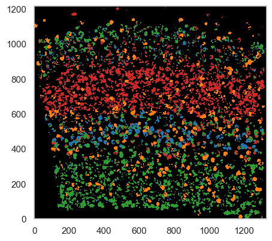

SSAM *guided* analysis
======================

The main visual output of SSAM is the creation of the cell-type map,
which is created by classifying pixels in the tissue image based of
either predefined or calculated genes expression signatures. When the
gene expression signatures are already known, one can use SSAM in
*guided* mode. When previously known cell type signatures are known, we
highly recommend running *guided* mode analysis as a quality check.

Single cell RNA sequencing data
-------------------------------

We will use scRNA-seq data from `Tasic et al.
2018 <https://doi.org/10.1038/s41586-018-0654-5>`__ for the guided
analysis. In the paper they identified “shared and distinct
transcriptomic cell types across neocortical areas” in the mouse brain,
also including the mouse VISp (which is our exmaple).

First we need to download the data:

::

   !curl -L https://ndownloader.figshare.com/files/26404781 -o sc_mouse_cortex.h5ad # data grabbed from SquidPy tutorial

Then we can load the data using ``scanpy``:

::

   # ``scanpy`` is needed for loading the data, install it with ``pip install scanpy``
   import scanpy as sc
   adata = sc.read_h5ad("sc_mouse_cortex.h5ad")

   # filter out and reorder genes according to the SSAM dataset ds.genes
   adata = adata[:, adata.var_names.isin(ds.genes)]
   adata = adata[:, ds.genes]

Cell-type gene expression signatures
------------------------------------

Once the data is loaded, we can calculate the average gene
expression per cell type (the ``centroids``), which can then be used for
classifying pixels in the image

::

   scrna_clusters = []
   scrna_centroids = []
   for cl, grp in adata.obs.groupby("cell_class"):
      scrna_clusters.append(cl)
      scrna_centroids.append(
         adata[grp.index].X.mean(axis=0).A1 # ``A1`` is used to convert the matrix to a numpy array
      )

Generate a *guided* cell-type map
---------------------------------

We can now continue to classify pixels in the tissue image using the
cell-type gene expression signatures from the sc-RNAseq data.

We map the local maxima vectors to the most similar clusters in the
scRNA-seq data.

By default, the ``filter_celltypemaps`` function will remove pixels that
do not correlate with any of the cell types above a certain threshold.
This is done to remove spurious pixels that do not belong to any cell
type.

By default, the threshold (``min_r`` parameter) is set to ``0.6``, but
you can adjust it if needed. In this example, we set it to ``0.3``, as
the scRNA-seq data is generated from a different tissue and the gene
expression signatures might not be as similar.

You can specify the colors of the cell types using the ``colors``
parameter. The colors should be a list of matplotlib colors, where the
order corresponds to the order of the cell types in the ``scrna_centroids``.

::

   analysis.map_celltypes(scrna_centroids)
   analysis.filter_celltypemaps(min_r=0.3, min_norm=0.05) # Adjust `min_norm` for filtering
   plt.figure(figsize=(5, 5))
   ds.plot_celltypes_map(colors=adata.uns['cell_class_colors'])

|image0|

Despite the guided mode producing passable results, we highly recommend
using the :doc:`de novo mode for more accurate analysis <05-de_novo>`__.

We can now use our celltype map to infer a map of :doc:`tissue domains <11-domain>`__.

