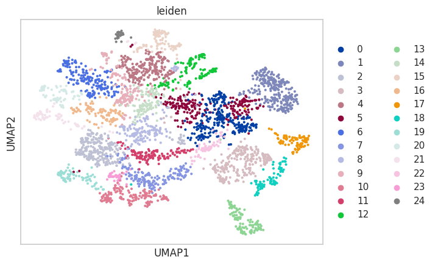
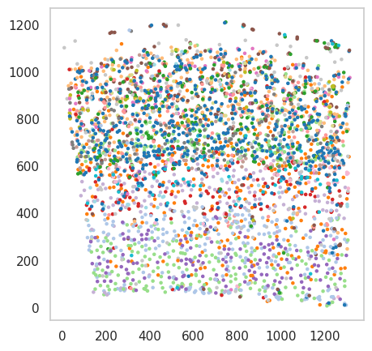

Segmenting the SSAM cell type map
=================================

While we demonstrate the accuracy of SSAM in reconstructing celltype
maps, we understand that many applications in biology require cell
segmentation. As such, the development branch of SSAM supports
segmentation of the celltype map using the ``watershed`` algorithm.

The ``run_watershed`` method takes the DAPI image as input and segments
the celltype map using the watershed algorithm. The DAPI image is used
as markers for the watershed segmentation. The segmentations and the
segmented celltype map are stored in the ``watershed_segmentations`` and
``watershed_celltype_map`` attributes of the ``Dataset`` object.

The segmentation of the cell type map can be performed by:

.. code-block:: python

   # Load DAPI image
   with open('zenodo/osmFISH/raw_data/im_nuc_small.pickle', 'rb') as f:
       dapi = pickle.load(f)
   dapi_small = np.hstack([dapi.T[:1640], np.zeros([1640, 12])]).reshape(ds.vf_norm.shape)
   
   # Threshold DAPI image to create markers
   dapi_threshold = filters.threshold_local(dapi_small[..., 0], 35, offset=-0.0002)
   dapi_thresh_im = dapi_small[..., 0] > dapi_threshold
   dapi_thresh_im = dapi_thresh_im.reshape(ds.vf_norm.shape).astype(np.uint8) * 255
   
   # Run watershed segmentation of cell-type maps with DAPI as markers
   analysis.run_watershed(dapi_thresh_im, df) # df is the dataframe containing the spot locations

Below we demonstrate the application of the segmentation on the *de
novo* celltype map generated for the mouse SSp osmFISH data.

|image0|

After running the watershed segmentation, the cell by gene matrix and the center of mass
of the segmented celltype map can be used to generate a cell by gene matrix for the segmented
celltype map. This can be used for further downstream analysis such as cell-cell communication
analysis.

The cell by gene matrix can be accessed by ``cell_by_gene_matrix`` and the center of mass
of the segments can be accessed by ``center_of_masses`` attributes of the ``SSAMDataset``
object. Below we demonstrate a simple reanalysis of the segmented celltype map using
Scanpy.

.. code-block:: python

    import scanpy as sc
    adata = sc.AnnData(ds.cell_by_gene_matrix)

    sc.pp.normalize_total(adata, target_sum=1e4)
    sc.pp.log1p(adata)
    sc.pp.scale(adata)
    sc.pp.neighbors(adata, n_neighbors=10, n_pcs=40)
    
    sc.tl.umap(adata)
    sc.tl.leiden(adata)
    sc.pl.umap(adata, color='leiden')

|image1|

.. code-block:: python

    plt.figure(figsize=(5, 5))
    plt.scatter(ds.center_of_masses[:, 0], ds.center_of_masses[:, 1], c=[int(i) for i in adata.obs['leiden']], cmap='tab20', s=5)

|image2|

.. |image0| image:: ../images/segmented_celltype_map.png

